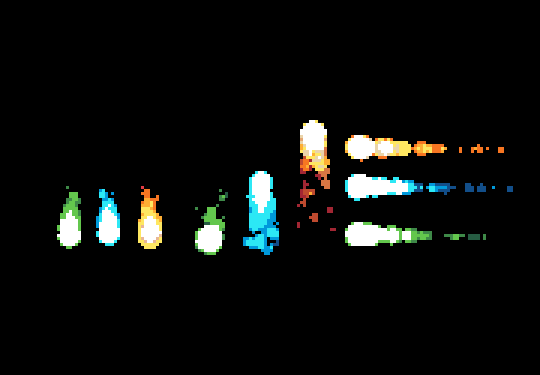

# MOON GLITCH
A JavaScript endless runner game built with Phaser 3.

## Table of Contents

* [Game Instructions](#game-instructions)
* [Live Demo](#demo)
* [Future Features](#future-features)
* [Built With](#built-with)
* [Testing](#testing)
* [Design Credits](#design-credits)
* [Contributing](#contributing)
* [Acknowledgments](#acknowledgments)
* [Authors](#author)
* [License](#license)

## Game Instructions

### Installation

- You can get a local copy of the repository please run the following commands on your terminal:
```
$ cd <folder>
$ git clone git@github.com:dansantander/moonglitch.git
```
- Open your terminal and go inside the folder you just cloned
- Run the command 'npm run-script start' and it will build and open the game on a new browser window.

### Game Concept

It's year 2030.
10 years ago, Moon was blasted by a weird out of orbit asteroid, spreading our known concept of unidirectional time into multidirectional time layers and causing strange random loopings and glitches.
Later we found that the so called 'asteroid' was part of a bigger plan to harness the infinite energy produced by the loopings.
We don't know who the author of this evil plan is, but it seems someone is trying to help us too by leaving what we know as Ruby Gems all around the world.
In order to be able to figure out how to break out of the loops, we need to collect as much Ruby Gems as we can.
Think you have what it takes to help human kind getting rid of this nightmare?


### How to play

- To move our character you should use the left and arrow keys on your keyboard.
- You can jump with the up arrow key.
- Collect Ruby gems in order to increase score.
- Avoid nitrogen fire balls and falling from platforms.

#### Kobe (The Hero)


- Kobe comes frome an ancient samurai dinasty. He has the mental nimble and physical strength to endure demanding quests. His weapon is an original Muramasa katana wrought up in hell itself.

#### Interactive Scenario


- We still don't know how they work, but Ruby gems help pausing time loops for a while. This is really helpful, however, we'll need further investigation to break the loops forever. Collect as much ruby gems as you can. They will also keep you healthy and strong for this task.



- The evil author of the loopings is trying to keep us away from the gems by compressing air's nitrogen into fire balls. Avoid nitrogen fire balls at all costs, otherwise you'll die instantly.

## Demo

[Live Demo](https://)

## Future Features

- More fire balls.
- Enemies
- Hero can use his katana to fight against enemies
- Difficulty increasing after certain number of scored points
- Double jumps for hero to reach higher platforms

## Built With
- Javascript
- HTML
- Phaser 3
- Webpack
- Babel
- Leaderboard API
- JEST testing
- Heroku
- ESlint and Stylelint as linters

## Testing

- Unit tests with Jest. You can run the tests with the following code:

```
$ npm test
```

## Design Credits

- All assets used in this game came frome [itch.io](https://itch.io/game-assets/free)
- [Moonglitch](https://hugues-laborde.itch.io/environment-pack-01) and platforms are part of Hugues Laborde's work
- [Fireballs](https://stealthix.itch.io/animated-fires) used in this game are part of Sealhix's work
- The [hero](https://luizmelo.itch.io/martial-hero) sprite sheet used is part of Luis Meloz's work 

## Contributing

Contributions, issues and feature requests are welcome!

You can do it on [issues page](issues/).

## Acknowledgments

Special thanks to code reviewers.

## Show your support

Give a ⭐️ if you like this project!

## Author

👤 **Daniel Santander**

- Github: [@dansantander](https://github.com/dansantander)
- Linkedin: [Daniel Santander](https://www.linkedin.com/in/daniel-santander)
- Twitter: [@dansantandr](https://twitter.com/dansantandr)

## License

<strong>Creative Commons 2020</strong>