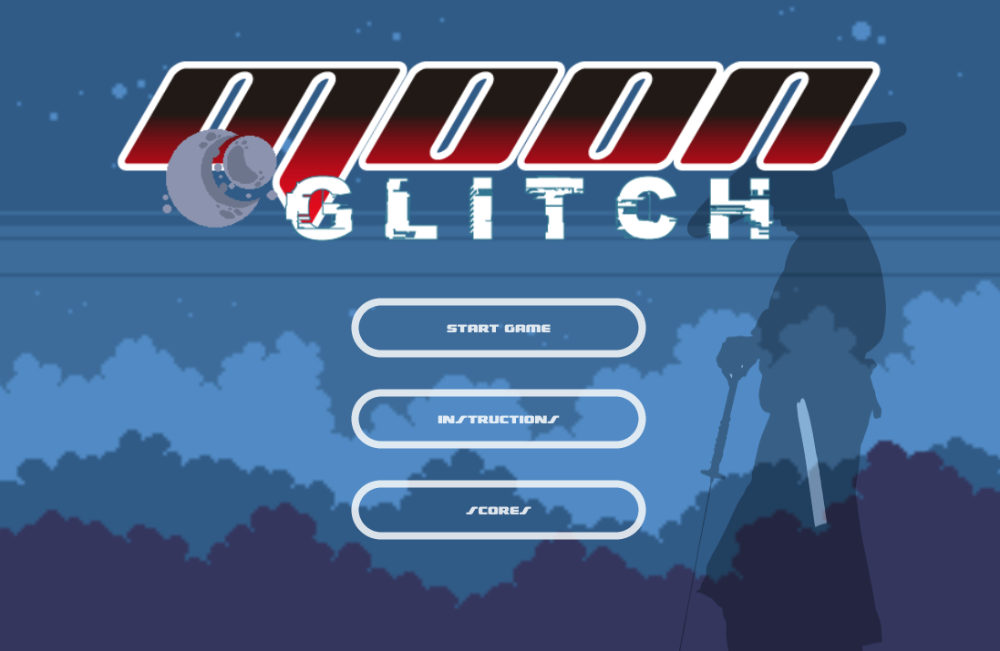

# MOON GLITCH
A JavaScript endless runner game built with Phaser 3.



## Table of Contents

* [Game Instructions](#game-instructions)
* [Live Demo](#demo)
* [Future Features](#future-features)
* [Built With](#built-with)
* [Testing](#testing)
* [Design Credits](#design-credits)
* [Contributing](#contributing)
* [Acknowledgments](#acknowledgments)
* [Authors](#author)
* [License](#license)

## Game Instructions

### Prerequisites

- Node. If you do not have Node installed in your local machine, please refer to the [Official Documentation](https://nodejs.org/en/download/)
- Basic terminal or command line knowledge.

### Installation

- You can get a local copy of the repository by running the following commands in your terminal:
```
$ cd <folder>
$ git clone git@github.com:dansantander/dawn.git
```
- Run the command 'npm start' inside the folder of the project you just cloned to run the server.
- Finally, open [http://localhost:8080/](http://localhost:8080/) on your browser.

### Game Concept

It's year 2030.
10 years ago, Moon was blasted by a weird out-of-orbit asteroid, spreading our known concept of unidirectional time into multidirectional time layers and causing strange random loopings and glitches in our reality.
Later we found that the so called 'asteroid' was part of a bigger plan to harness the infinite energy produced by the loopings.
Loops keep damaging Earth's gravitational field, causing natural disasters all over the world.
We don't know who the author of this evil plan is, but it seems someone is trying to help us too by leaving what we know as Ruby Gems scattered all around the globe.
Ruby Gems seem to stop loops at least for a while.
In order to be able to figure out how to break the loops for good, we need to collect as much Ruby Gems as we can.
Think you have what it takes to help human kind getting rid of this nightmare?

### How to play

- To move the character you should use the 'left' and 'right' arrow keys on your keyboard.
- You can jump with the 'up' arrow key.
- Collect Ruby Gems in order to increase score.
- Avoid nitrogen fire balls and falling from platforms.

#### Kobe (The Hero)


- Kobe comes frome an ancient samurai dinasty. He has the mental nimble and physical strength to endure demanding quests. His weapon is an original Muramasa katana wrought up in hell itself.

#### Interactive Scenario


- We still don't know how they work, but Ruby gems help pausing time loops for a while. This is really helpful, however, we'll need further investigation to break the loops forever. Collect as much ruby gems as you can. They will also keep you healthy and strong for this task.


- The evil author of the loopings is trying to keep us away from the gems by compressing air's nitrogen into fire balls. Avoid nitrogen fire balls at all costs, otherwise you'll die instantly.

## Demo

[Live Demo](https://intense-journey-88840.herokuapp.com/)

## Game Development Stages

- **Day 1**
**Learn Phaser 3 module**
 The main goal for this first day was to learn the basics of how to use Phaser. I coded along the Phaser game basics tutorial and some YouTube tutorials to get familiar with the syntax and how everything worked together. As I wanted to achieve a Parallax effect for my background to make it look cool when my character moved, I stubbornly dedicated a lot of time on it, but by the end of Day 1, I was able to achieve both of my goals, thus understanding Phaser's general features.

- **Day 2**
**Game Design**
 My goal for the second day was to design the whole concept of my game and finding the textures and sprites for my character and game environment. As I was scrolling through game assets websites I found the moon glitch sprite which immediately led me to my 'Eureka' moment. I decided to go with something that combined two cool concepts: Science fiction and samurais. By the end of Day 2, I had my whole game concept and a bunch of assets to pick from.

- **Day 3**
**Scene Development**
 My goal for this day was to complete all of the game scenes without getting too much into the game logic. I coded the API calls and the basic layouts of all of my scenes. Then, I started polishing some of my game assets, which consumed a lot of my time for I had to trim some of them to fit perfectly into the animation frames. By the end of Day 3, I had my whole scenes working perfectly and the API calls as well.

- **Day 4**
**Game Development**
 My goal for Day 4 was to actually work on my game code. This day was tough because some of the gaps in my Phaser knowledge started to appear before me. I had to read Phaser documentation more in-depth and revisit some of the tutorials I watched on Day 1. By the end of Day 4, I achieved to build a very basic functionality for my game.

- **Day 5**
**Testing & Deployment**
 My goal for this day was to work on the tests and Heroku deployment. I watched some mock testing tutorials and revisited Jest website. Heroku deployment was not that demanding.
By the end of Day 5, I submitted my project for TSE revision.

## Future Features

- More fire balls.
- Enemies.
- Hero can use his katana to fight against enemies.
- Difficulty increasing after certain number of scored points.
- Double jumps for hero to reach higher platforms.

## Built With
- Javascript
- HTML
- Phaser 3
- Webpack
- Babel
- Leaderboard API
- JEST testing
- Heroku
- ESlint and Stylelint as linters

## Testing

- Unit tests with Jest. You can run the tests with the following code:

```
$ npm run test
```

## Design Credits

- All assets used in this game came from [itch.io](https://itch.io/game-assets/free).
- [Moonglitch](https://hugues-laborde.itch.io/environment-pack-01) and platforms are part of Hugues Laborde's work.
- [Fireballs](https://stealthix.itch.io/animated-fires) used in this game are part of Sealhix's work.
- The [hero](https://luizmelo.itch.io/martial-hero) sprite sheet used is part of Luis Meloz's work .

## Contributing

Contributions, issues and feature requests are welcome!

You can do it on [issues page](issues/).

## Acknowledgments

Special thanks to code reviewers.

## Show your support

Give a ⭐️ if you like this project!

## Author

👤 **Daniel Santander**

- Github: [@dansantander](https://github.com/dansantander)
- Linkedin: [Daniel Santander](https://www.linkedin.com/in/daniel-santander)
- Twitter: [@dansantandr](https://twitter.com/dansantandr)

## License

<strong>Creative Commons 2020</strong>